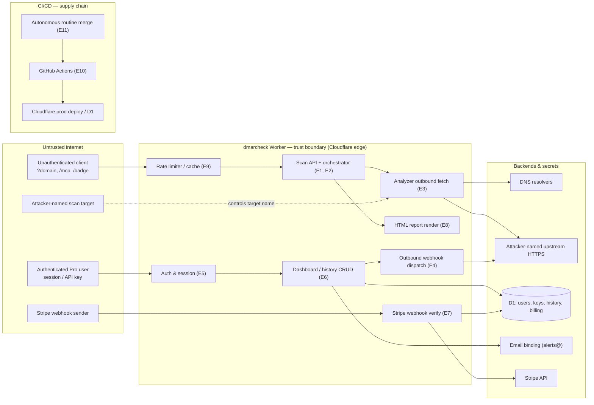

# Threat Model: dmarcheck

## 1. System context

dmarcheck is a DNS email-security analyzer (DMARC, SPF, DKIM, BIMI, MTA-STS,
MX, security.txt, TLS-RPT) implemented as a single TypeScript Cloudflare Worker
on the Hono framework. It performs DNS lookups via `node:dns` (`nodejs_compat`),
runs one analyzer module per protocol in parallel through an orchestrator
(each analyzer isolated, so one failure surfaces as a synthetic result rather
than aborting the scan), computes a letter grade, and serves dual output: a JSON
API and a server-rendered interactive HTML report. It is live at dmarc.mx,
deployed continuously from `main` via Cloudflare Git integration. Dependencies
are lean (`hono`, `jose`, `@sentry/cloudflare`).

The same MIT-licensed code runs as three tiers: a free anonymous scanner
(rate-limited 10 req/IP/min), a Pro tier ($19/mo, active only when D1 + WorkOS
+ Stripe bindings are configured — nightly cron monitoring, email grade-drop
alerts, saved scan history, bulk scan, 60 req/hr API keys), and self-hosting.
It additionally exposes agent-discovery surfaces (RFC 9727 linkset, OpenAPI,
an unauthenticated `POST /mcp` `scan_domain` tool). Maintained by a single
developer; autonomous Claude Code "Routine" pipelines open and auto-merge PRs
unattended, gated by a fail-closed trust gate plus branch protection. It runs
on Cloudflare's edge with a D1 database, a daily cron, an email-sending
binding, and a sibling `mta-sts.dmarc.mx` helper worker.

## 2. Assets

| asset | description | sensitivity |
|---|---|---|
| Stripe secret key & webhook signing secret | Billing API auth + inbound webhook verification; grants charge/refund/customer access if leaked | critical |
| Cloudflare API / D1 / deploy tokens | Infra control; the D1-edit token is deliberately scoped and separated from the deploy token to limit blast radius | critical |
| User API keys (`dmk_…` bearer tokens) | Authenticate Pro API callers (60 req/hr); SHA-256 hashed at rest | high |
| Session tokens / JWTs | Authenticate dashboard users (WorkOS AuthKit relying party); HS256 session cookie | high |
| User emails & Stripe customer/subscription rows (D1) | PII + billing linkage; target of IDOR / cross-tenant leak | high |
| Integrity of computed grades / scan results | The product's core trust output; manipulation misleads users about their email-security posture | high |
| Scan history & monitored-domain lists (D1) | Per-user saved results; cross-tenant read risk | medium |
| Email-sending binding (`alerts@dmarc.mx`) | Abuse = spoofed alerts / spam from a verified sender | medium |
| Service availability (dmarc.mx + mta-sts helper) | Edge availability; DoS is out of scope per SECURITY.md but the outbound-fetch surface is real | medium |

## 3. Entry points & trust boundaries

The diagram shows where untrusted input crosses into the Worker's trusted
execution context. Each labelled edge maps to an entry point (E1–E11) in the
table below.

| entry_point | description | trust_boundary | reachable_assets |
|---|---|---|---|
| E1 — Public scan API (`/check`, `/api/check`, `/api/check/stream`, `/badge`, `/mx/:slug`) | Attacker controls `?domain`, `?selectors`, `?format`, `Accept`; drives DNS lookups + HTML/JSON/CSV/SSE rendering | unauth HTTP → app logic; Worker → upstream DNS | grade integrity, service availability |
| E2 — MCP handler (`POST /mcp` `scan_domain`) | Arbitrary JSON-RPC body; `domain`/`dkim_selectors` drive a full scan. No bearer requirement and **no rate-limit middleware** (contrast `/check`) | unauth HTTP → Worker → DNS/HTTP | service availability, grade integrity |
| E3 — Analyzer outbound fetch (MTA-STS, security.txt, BIMI) | Scanned domain interpolated into upstream HTTPS URLs; MTA-STS uses `redirect: "manual"`, security.txt uses `redirect: "follow"` | Worker → attacker-named upstream HTTP | internal network, service integrity |
| E4 — Outbound webhook dispatch | Fetches a Pro user's saved `webhook.url`; save path validates only `protocol === "https:"` | authenticated user → Worker outbound to arbitrary host | internal network, service integrity |
| E5 — Auth & session (session cookie JWT, bearer API key, Cloudflare Access JWT) | HS256 session HMAC + exp; `dmk_` API key SHA-256 lookup; `jose` RS256 Access JWT (preview only, fail-closed) | unauth → authenticated identity | all authenticated assets |
| E6 — Dashboard CRUD + history/bulk-scan APIs (D1, per-user) | Authenticated reads/writes scoped by `WHERE user_id = ?` / `getDomainByUserAndName` | authenticated session → another user's data | scan history, API keys, user/billing data |
| E7 — Stripe webhook (`POST /webhooks/stripe`) | Raw-body HMAC-SHA256 verify, 5-min skew, event-id idempotency, then mutates subscription state | unauth internet → billing state mutation | subscription state, billing data |
| E8 — HTML report rendering (`src/views/*`) | User/DNS-derived values interpolated into template-literal HTML | scan data → rendered HTML in a viewer's browser | viewer session, grade integrity |
| E9 — Rate limiter / cache | Keyed on `CF-Connecting-IP` (`ip:<x>`) or `user:<id>`; Cache API store with in-memory fallback | spoofable identity / shared cache key | service availability |
| E10 — CI/CD + deploy (GitHub Actions: ci, codeql, migrate, release, deploy-mta-sts; Cloudflare Git integration) | `pull_request` on a public repo; `main`-gated jobs hold prod D1 / deploy / release tokens | PR/main → CI runner → prod | infra tokens, prod D1, releases |
| E11 — Autonomous-routine PR merge path | External routine identity opens + auto-merges PRs; CODEOWNERS + fail-closed gate | external automation → `main` | analyzers, orchestration, scoring, CI |

## 4. Threats

| id | threat | actor | surface | asset | impact | likelihood | status | controls | evidence |
|---|---|---|---|---|---|---|---|---|---|
| T1 | Authentication/session bypass via JWT, API-key, or Access-token verification flaw | remote_unauth | E5 | all authenticated assets | critical | rare | partially_mitigated | jose for Access JWT; session HMAC verify hardcoded to HS256; API keys SHA-256 hashed and shape-checked | |
| T2 | SSRF / internal-network probing via attacker-controlled outbound webhook URL | remote_auth | E4 | internal network, service integrity | high | possible | partially_mitigated | `protocol === "https:"` check on save; no host allowlist or private-IP/redirect guard on dispatch fetch | |
| T3 | SSRF / policy bypass via redirect or IP-literal on analyzer outbound fetch | remote_unauth | E3 | internal network, service integrity | high | possible | partially_mitigated | MTA-STS `redirect: "manual"` + opaqueredirect guard; `normalizeDomain` rejects IPv4 literals; 3s timeout | #58, #92, #104, #108 |
| T4 | Cross-tenant disclosure of scan history / API keys / billing data via missing ownership check (IDOR) | remote_auth | E6 | scan history, API keys, user/billing data | high | possible | partially_mitigated | parameterized D1 `.bind()` everywhere; `WHERE user_id = ?` / `getDomainByUserAndName` ownership scoping | |
| T5 | Malicious security-sensitive change auto-merged while the CODEOWNERS gate is advisory | supply_chain | E11 | analyzers, orchestration, scoring | high | possible | partially_mitigated | fail-closed `routine-gate` (allowlist + `spec-approved` label + risk-path denylist); CODEOWNERS path-scoping | #299, #300 |
| T6 | Secret or PII exposure via logs or error responses | remote_unauth | E1, E5, E7 | secrets, user/billing data | high | possible | unmitigated | Sentry capture; no documented scrubbing audit | |
| T7 | Billing privilege escalation (free → paid) via forged or replayed Stripe webhook | remote_unauth | E7 | subscription state | high | rare | partially_mitigated | raw-body HMAC-SHA256 verify, constant-time compare, 5-min skew, event-id idempotency | |
| T8 | Supply-chain / CI compromise escalating to prod D1 write or deploy | supply_chain | E10 | prod D1, infra tokens, releases | high | rare | partially_mitigated | SHA-pinned actions, ubuntu-latest only, explicit `permissions:` blocks, secrets only on `main`-gated jobs | |
| T9 | Rate-limit bypass → DNS amplification / scan abuse via unauthenticated, unmetered `/mcp` and non-`/check` scan routes | remote_unauth | E2, E9 | service availability, upstream DNS | medium | likely | partially_mitigated | `CF-Connecting-IP` keying on `/check`; XFF no longer trusted | #71, #123, #59 |
| T10 | Stored/reflected XSS via unescaped scan data rendered into the HTML report | remote_unauth | E8, E1 | viewer session, grade integrity | medium | possible | partially_mitigated | `esc()` on interpolated values; per-request CSP nonce + `strict-dynamic`; `default-src 'none'` | #59, #281, 0fc81e2 |
| T11 | Denial of service via DNS resource exhaustion or scan-abort on attacker-controlled domains | remote_unauth | E1, E3 | service availability | medium | possible | partially_mitigated | SPF lookup-limit early-exit; per-analyzer failure isolation (one analyzer error can't abort the scan); `DnsLookupError` catch on external lookups | #90, #354 |
| T12 | Login CSRF / OAuth-flow tampering | remote_unauth | E5 | user session | medium | rare | mitigated | OAuth `state` cookie (HttpOnly/Secure/SameSite=Lax) + strict callback match | #150 |

## 5. Deprioritized

| threat | reason |
|---|---|
| Volumetric / network-layer DoS against dmarc.mx | Explicitly out of scope per SECURITY.md; handled at the Cloudflare edge. Application-layer amplification (T9, T11) is in scope. |
| Cloud metadata-service SSRF (169.254.169.254) | Cloudflare Workers egress does not expose a cloud metadata endpoint; IP-literal reject (`normalizeDomain`) is defense-in-depth. Internal-service SSRF (T2, T3) remains in scope. |
| Repudiation / audit-log tampering | Single-operator service; no multi-admin actions whose attribution is security-relevant. |
| Alg-confusion on the session JWT | Verify is hardcoded to HS256, so the unvalidated header `alg` is not currently exploitable. Tracked as a brittleness note in section 6, not an active threat. |

## 6. Open questions

- **Sentry / log scrubbing (T6):** Are request bodies, headers (cookies,
  bearer tokens), and Stripe payloads scrubbed before capture? What goes into
  error-response bodies on a 500?
- **Webhook SSRF posture (T2):** Is the outbound-webhook feature intended to
  reach arbitrary user hosts, or should it enforce a public-IP/host allowlist
  and `redirect: "manual"`? Does the dispatch fetch currently follow redirects?
- **`/mcp` rate limiting (T9):** Is the unauthenticated MCP scan path
  intentionally exempt from `rateLimitMiddleware`, or an oversight? Same
  question for `/badge` and `/mx/:slug`.
- **Bot-identity split (T5):** Has #299 landed? Until the routine runs as a
  non-admin identity, the CODEOWNERS gate is advisory (admin bypasses the
  ruleset).
- **D1 token scope (T8):** Is `deploy-mta-sts.yml`'s broad `CLOUDFLARE_API_TOKEN`
  reducible to a Worker-scoped token like the D1 migration token?
- **Session JWT `alg` (brittleness):** Should `session.ts` assert the header
  `alg` is `HS256` to harden against a future change that introduces key
  flexibility?

## 7. Provenance

- mode: bootstrap
- date: 2026-05-28
- target: /Users/cory/dmarcheck @ a2f0205
- inputs: git-log + GitHub advisories mined (no public advisories); no `--vulns` file
- owner: unset

## 8. Recommended mitigations

| mitigation | threat_ids | closes_class | effort |
|---|---|---|---|
| Enforce a public-host allowlist + `redirect: "manual"` + private-IP/DNS-rebinding guard on all server-side fetches built from user input | T2, T3 | partial | M |
| Apply `rateLimitMiddleware` to every scan-triggering route (`/mcp`, `/badge`, `/mx/:slug`, SSE) — centralize "any route that performs a DNS scan is rate-limited" | T9, T11 | yes | S |
| Centralize per-user row scoping in a query helper so no handler can issue an unscoped read/write of a tenant-owned table | T4 | yes | M |
| Keep all HTML interpolation behind `esc()` and the CSP nonce; lint/block raw user input inside inline `<script>` or unescaped attributes | T10 | yes | S |
| Audit Sentry/error paths for secret + PII scrubbing; never echo internal state in 5xx bodies | T6 | partial | S |
| Land the #299 bot-identity split so routines run as a non-admin identity and the CODEOWNERS gate becomes enforcing, not advisory | T5 | yes | M |
| Assert `alg: HS256` when verifying the session JWT (defense-in-depth against future key-flexibility regressions) | T1 | partial | S |
| Scope `deploy-mta-sts.yml` to a Worker-scoped token instead of the broad `CLOUDFLARE_API_TOKEN` | T8 | partial | S |
